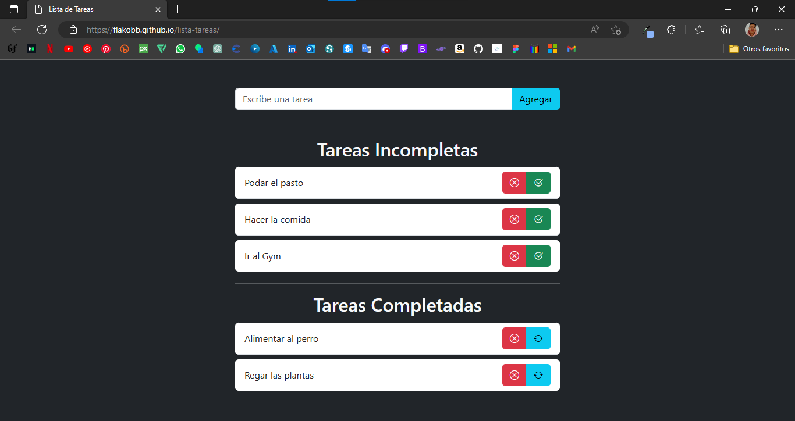

# **Lista de tareas**

[Despliegue](https://flakobb.github.io/lista-tareas/)

Esta es una aplicacion web programada con JavaScript y usando Bootstrap para los estilos de la pagina. Permite al usuario hacer una lista de tareas pendientes.

- Al crear una nueva tarea se guarda en la lista de tareas incompletas.

- Cuando el usuario presiona el boton de tarea terminada (boton verde), esta se mueve a la lista de tareas completadas.

- Las tareas contempladas tienen un nuevo boton (boton azul) que permite al usuario volver a mover la tarea hacia la lista de tareas incompletas.

- En ambas listas cada tarea tiene un boton rojo para eliminar la tarea; al presionarlo se abrira una ventana modal que pregunta si en verdad se quiere eliminar la tarea.

**Nota:** Las tareas no se guardan... aún.